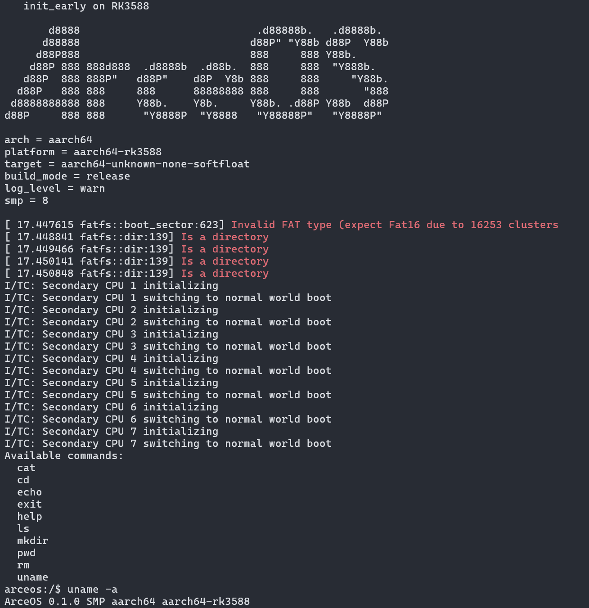

# axplat-aarch64-rk3588

Implementation of ArceOS [axplat](https://github.com/arceos-org/axplat_crates/tree/main/axplat) hardware abstraction layer for `Rockchip RK3588` board.

## QUICK START

#### Firstly, Install Rockchip RK3588 platform dependency crate.

*Take  APP:examples/shell as an example*<br>
*Run only for the first time*

```bash
cd /path/to/ArceOS

cargo axplat add axplat-aarch64-rk3588 --package arceos-shell --features smp --git https://github.com/elliott10/axplat_crates.git

# Check the information of Rockchip RK3588 platform
cargo axplat info axplat-aarch64-rk3588

# Add the platform dependency crate on ArceOS App.
# eg. examples/shell
echo "extern crate axplat_aarch64_rk3588;" >> examples/shell/src/main.rs
```

#### Compile the U-Boot bootable image

A u-boot bootable image file `examples/shell/shell_aarch64-rk3588.uimg` will be generated.

```bash
make SMP=8 MYPLAT=axplat-aarch64-rk3588 A=examples/shell FEATURES=page-alloc-4g,driver-ramdisk BUS=mmio UIMAGE=y
```

#### Boot ArceOS image by U-Boot

As you can see in the following picture, 

ArceOS is launched on Rockchip RK3588 and all `8` cores have been launched !



## Usage of the code

#### 1. Write your kernel code

```rust
#[axplat::main]
fn kernel_main(cpu_id: usize, arg: usize) -> ! {
    // Initialize trap, console, time.
    axplat::init::init_early(cpu_id, arg);
    // Initialize platform peripherals (not used in this example).
    axplat::init::init_later(cpu_id, arg);

    // Write your kernel code here.
    axplat::console_println!("Hello, ArceOS!");

    // Power off the system.
    axplat::power::system_off();
}
```

#### 2. Link your kernel with this package

```rust
// Can be located at any dependency crate.
extern crate axplat_aarch64_rk3588;
```

#### 3. Optional: Use a linker script
